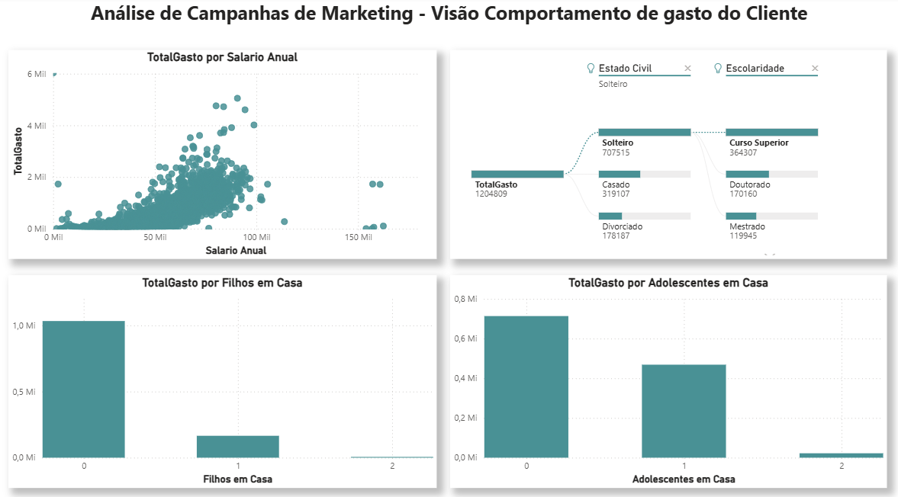
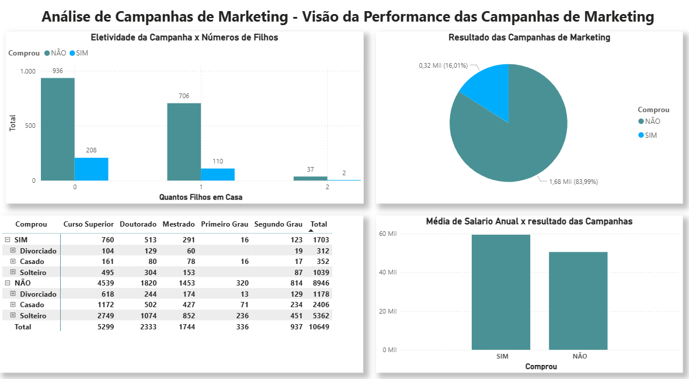
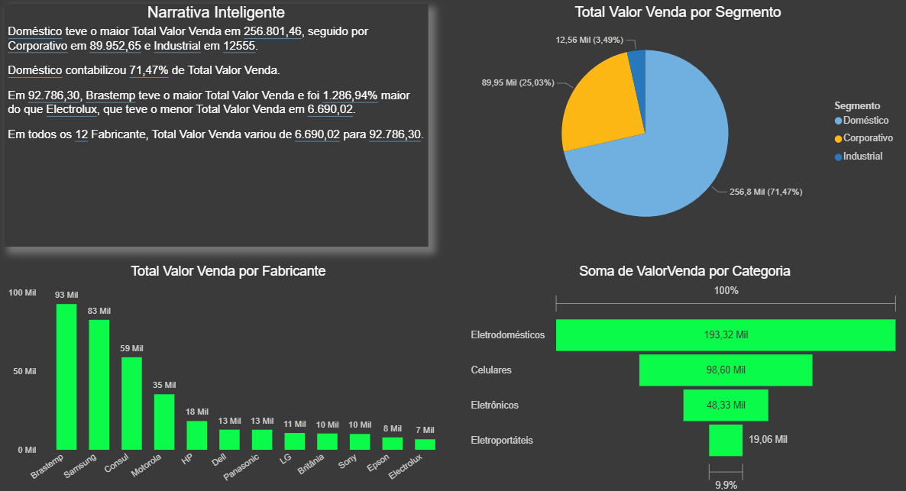
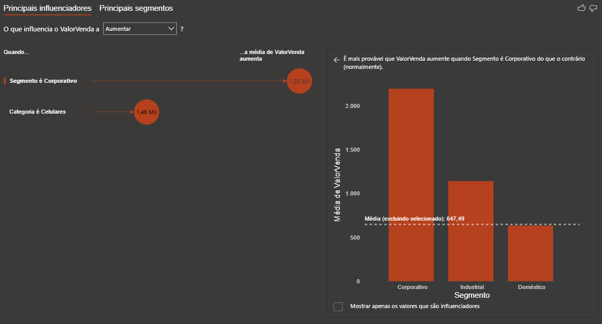
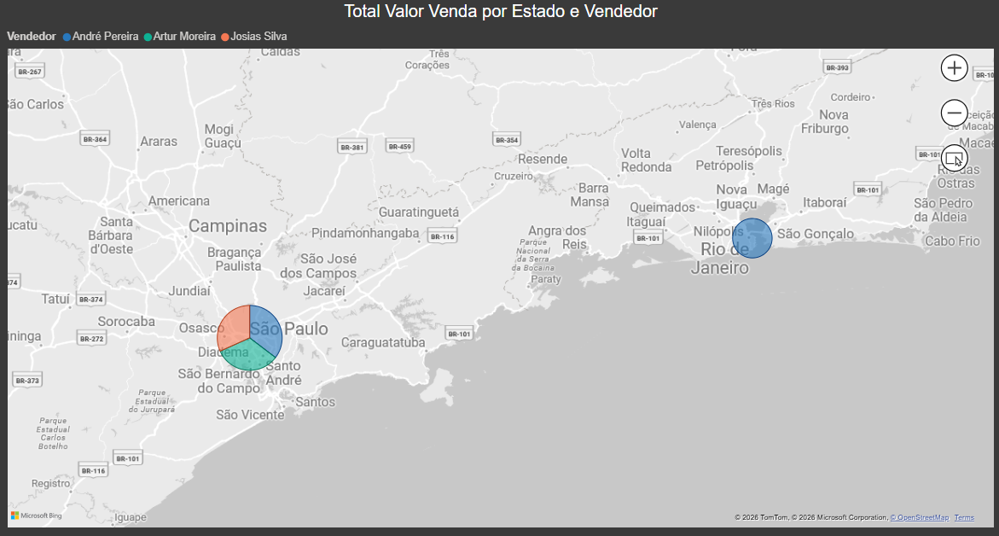
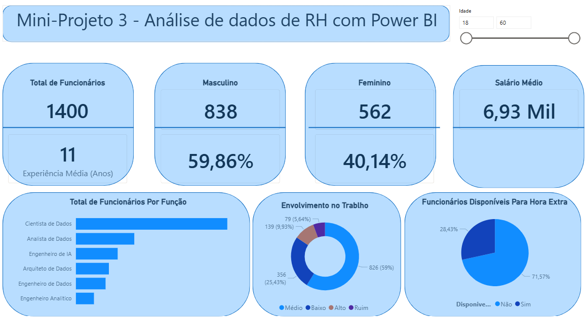
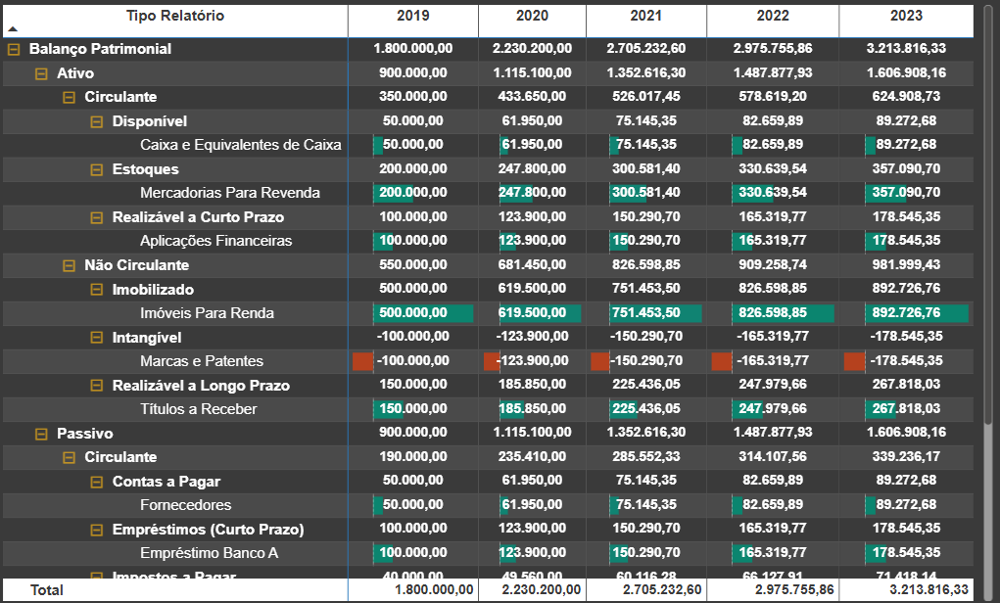
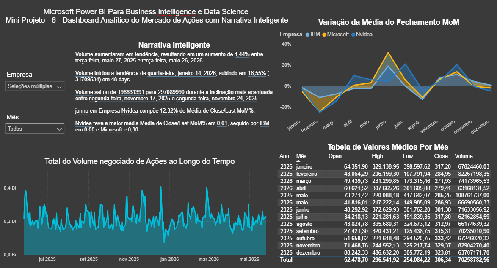

# 🚀 Curso de Microsoft Power BI Para Business Intelligence e Data Science

## 📚 Sobre
Este repositório documenta minha jornada de aprendizado em projetos de Business Intelligence e Data Science utilizando Power BI
Aqui você encontrará dashboards, exercícios práticos e anotações que refletem minha evolução na área de análise de dados.

## 🎯 Objetivos
- Aprender a conectar e transformar dados com Power Query;
- integrando o Power BI com Linguagem R e Python.
- Criar medidas e indicadores usando DAX
- Desenvolver dashboards interativos e analíticos
- Construir um portfólio sólido para transição de carreira

## 📊 Projetos e mini projetos Desenvolvidos
#### Projetos

### Parte 1: Business Intelligence
#### [1. Laboratório Prático 1 - Dashboard Analítico de Vendas Globais](#1-laboratório-prático-1---dashboard-analítico-de-vendas-globais-1)
#### [2. Laboratório Prático 2 - Dashboard de Vendas, Custo, Margem de Lucro e KPI](#2-laboratório-prático-2---dashboard-de-vendas-custo-margem-de-lucro-e-kpi-1)
#### [3. Mini-Projeto 1 - Análise de Campanhas de Marketing](#3-mini-projeto-1---análise-de-campanhas-de-marketing-1)
#### [4. Mini-Projeto 2 - Análise de Dados Comerciais: Performance de Vendas](#4-mini-projeto-2---análise-de-dados-comerciais-performance-de-vendas-1)
#### [5. Mini-Projeto 3 - Análise de Dados de Recursos Humanos](#5-mini-projeto-3---análise-de-dados-de-recursos-humanos-1)
#### [6. Mini-Projeto 4 - Análise de Dados de Logística](#6-mini-projeto-4---análise-de-dados-de-logística-1)
#### [7. Mini-Projeto 5 - Análise de Dados Financeiros](#7-mini-projeto-5---análise-de-dados-financeiros-1)
#### [8. Laboratório Prático 3 - Análise de Dados Contábeis: Balanço patrimonial](#8-laboratório-prático-3---análise-de-dados-contábeis-balanço-patrimonial-1)
#### [9. Mini-Projeto 6 - Análise de Dados do Mercado de Ações](#9-mini-projeto-6---análise-de-dados-do-mercado-de-ações-1)

### Parte 2: Data Science
#### [10. Laboratório Prático 4 - Limpeza e Manipulação de Dados de Cadastro de Clientes](#10-laboratório-prático-4---limpeza-e-manipulação-de-dados-de-cadastro-de-clientes-1)
#### [11. Laboratório Prático 5 - Engenharia de Atributos com Linguagem M](#11-laboratório-prático-5---engenharia-de-atributos-com-linguagem-m-1)
#### [12. Laboratório Prático 6 - Integrando Banco de Dados com Power BI para Extração e Análise de Dados](#12-laboratório-prático-6---integrando-banco-de-dados-com-power-bi-para-extração-e-análise-de-dados-1)
#### [13. Laboratório Prático 7 - Machine Learning com Linguagem Python e Power BI dentro do Jupyter Notebook](#13-laboratório-prático-7---machine-learning-com-linguagem-python-e-power-bi-dentro-do-jupyter-notebook-1)
#### [14. Laboratório Prático 8 - Detecção de Anomalias em Transações Financeiras com Linguagem R e Power BI](#14-laboratório-prático-8---detecção-de-anomalias-em-transações-financeiras-com-linguagem-r-e-power-bi-1)
#### [15. Laboratório Prático 9 - Engenharia de Producão com Power BI e IA: Prevendo a Produção Industrial ao Longo do Tempo](#15-laboratório-prático-9---engenharia-de-producão-com-power-bi-e-ia-prevendo-a-produção-industrial-ao-longo-do-tempo-1)

## 1. Laboratório Prático 1 - Dashboard Analítico de Vendas Globais

Neste cenário usando uma empresa fictícia que comercializa produtos no Mundo inteiro.

Criado o Dashboard para responder as questões abaixos:
- Pergunta 1 - Qual o valor total vendido?
- Pergunta 2 - Quantas vendas foram realizadas por categoria de produto?
- Pergunta 3 - Quantas vendas foram realizadas por país considerando a prioridade de entrega?
- Pergunta 4 - Qual foi a média de desconto nas vendas por subcategoria de produto?
- Pergunta 5 - Quais países tiveram maior média de valor de venda? Demonstre em um mapa.

O Dashboard deve dar ao usuário a possibilidade de filtrar os dados por ano, por segmento e por país.

### 1.1. Dashboard Analítico de Vendas Globais

## 🎯 Objetivos
- Aprender a conectar e transformar dados com Power Query;
- integrando o Power BI com Linguagem R e Python.
- Criar medidas e indicadores usando DAX
- Desenvolver dashboards interativos e analíticos
- Construir um portfólio sólido para transição de carreira

#### [Voltar ao início](#Projetos)

## 2. Laboratório Prático 2 - Dashboard de Vendas, Custo, Margem de Lucro e KPI
Foram utilizados dados de vendas fictícios obtidos em 4 diferentes tabelas: Clientes, Pedidos, Produtos e Vendas.

O Dashboard deve responder às seguintes perguntas de negócio e seguir as seguintes especificações:
- Pergunta 1 - Qual foi o total de valor venda considerando cada modo de envio dos pedidos? Use um gráfico de cascata.
- Pergunta 2 - Quais mercados tiveram o maior custo médio de envio dos produtos vendidos? Use um gráfico treemap.
- Pergunta 3 - A empresa tem como objetivo (meta) manter uma média de 350 para o valor de venda todos os meses. Mostre um indicador (KPI – Key Performance Indicator) com o valor médio de venda. A empresa ficou abaixo ou acima da meta no mês de Abril/2014?
- Pergunta 4 - Considere que o lucro é equivalente a: Valor Venda - Custo Envio. Qual categoria de produto apresentou maior lucro médio?
- Pergunta 5 - Qual foi o comportamento da margem de lucro ao longo do tempo? Considere a margem de lucro como o Lucro dividido pelo Valor Venda.

### 2.1. Dashboard de Vendas, Custo, Margem de Lucro e KPI

## 🎯 Objetivos
- Conceitos de modelagem de dados;
- Cardinalidade;
- Transformação com Power Query;
- Recursos de limpeza de dados do Power BI
- Criação de gráficos interativos e analíticos.
- Introdução ao DAX.

#### [Voltar ao início](#Projetos)

## 3. Mini-Projeto 1 - Análise de Campanhas de Marketing
Este Mini-Projeto trouxe uma breve introdução à análise de campanhas de Marketing com o Power BI. Foram gerados 4 Dashboards, mais de 10 elementos visuais, customizações, formatações, correções nos dados e utilização de diferentes recursos do Power BI. Os dados foram previamente customizados para este Mini-Projeto e representam informações sobre clientes e campanhas de Marketing realizadas por uma empresa fictícia.

Neste Mini-Projeto os relatórios foram divididos em 4 visões:
- Visão do Cliente
- Visão do Comportamento de Compra do Cliente
- Visão da Performance das Campanhas de Marketing
- Visão dos Padrões de Compra no Ponto de Venda (País)

Para cada visão foram compreendidas as variáveis, criados gráficos, medidas, extraídas métricas e cruzados os dados, visando entregar aos tomadores de decisão uma visão bastante completa sobre o perfil dos clientes, os padrões de compra e a efetividade das campanhas de Marketing.

### 3.1. Dashboard - Visão do Cliente

### 3.2. Dashboard - Visão do Comportamento de Compra do Cliente

### 3.3. Dashboard - Visão da Performance das Campanhas de Marketing

### 3.4. Dashboard - Visão dos Padrões de Compra no Ponto de Venda (País)

#### [Voltar ao início](#Projetos)

## 4. Mini-Projeto 2 - Análise de Dados Comerciais: Performance de Vendas
Neste Mini-Projeto foi desenvolvido uma analise de performance de vendas, ajudando o time comercial de uma empresa fictícia.

Aprendi a trabalhar com a Narrativa Inteligente, Principais Influenciadores, Gráfico de Faixas e criação de menu para índice do Dashboard.

### 4.0. Menu para Navegador de Página

### 4.1. Dashboard - Narrativa Inteligente

### 4.2. Dashboard - Principais Influenciadores de Vendas

### 4.3. Dashboard - Total de venda Por Categoria e Ponto de Venda
)

### 4.4. Dashboard - Performance dos Vendedores por Região

#### [Voltar ao início](#Projetos)

## 5. Mini-Projeto 3 - Análise de Dados de Recursos Humanos
Este Mini-Projeto trouxe uma breve introdução à análise de dados de RH (Recursos Humanos) com o Power BI, onde foram utilizados dados fictícios. Durante o projeto foram trabalhados alguns outros recursos e funcionalidades do Power BI, como tabela de medidas e coluna condicional. 

O Dashboard criado respondeu às seguintes perguntas de negócio:
- Qual o total de funcionários atualmente na empresa?
- Qual o tempo médio de experiência dos funcionários (em anos)?
- Qual o total e percentual de funcionários do gênero masculino e feminino?
- Qual a média salarial mensal?
- Qual o total de funcionários por função?
- Qual o percentual de funcionários disponíveis para fazer hora extra?
- Qual o nível de envolvimento dos funcionários no trabalho considerando 4 categorias: Ruim, Baixo, Médio e Alto?
- Este item não deve estar no Dashboard, mas precisa ser calculado: Qual o total e o percentual de funcionários que devem receber promoção? Considerando a coluna “Anos Desde a última Promoção” com a seguinte regra: Se o funcionário tiver 5 anos ou mais desde a última promoção, deve ter a promoção considerada. Caso contrário, a promoção não deve ser considerada agora.

### 5.1. Dashboard - Análise de Dados de Recursos Humanos

#### [Voltar ao início](#Projetos)

## 6. Mini-Projeto 4 - Análise de Dados de Logística
Este Mini-Projeto apresentou o seguinte estudo de caso com dados fictícios: Uma empresa de logística solicitou que um profissional fornecesse um dashboard para compreender como está o processo de entrega de produtos da empresa. O profissional não parecia ter muito conhecimento sobre Power BI e entregou um trabalho com nítidos problemas e erros. Os diretores da empresa pediram minha ajuda para revisar o dashboard, identificar e corrigir erros e problemas e apresentar uma nova versão. Todos os erros e problemas detectados devem ser justificados.

O Dashboard precisaria mostrar os seguintes KPIs de Logística:
- Total de Entregas no Prazo Por Canal de Entrega
- Percentual de Entregas Antecipadas Por Equipe de Entrega
- Total de Entregas Por Mês
- Total de Entregas de Produtos dos Top 5 Vendedores
- Total de Entregas com Atraso Por Cidade
- Percentual de Entregas Por Status de Entrega

Durante o projeto foram trabalhados alguns outros recursos e funcionalidades do Power BI, como classificação de rating e filtro com medida DAX. 

### 6.1. Dashboard - Análise de Dados de Logística

#### [Voltar ao início](#Projetos)

## 7. Mini-Projeto 5 - Análise de Dados Financeiros
Neste Mini-Projeto foram exploradas mais algumas funcionalidades do Power BI, agora no contexto da área de finanças. Foram utilizados dados fictícios, que continham problemas de layout colocados propositalmente e que foram então resolvidos, utilizando algumas funcionalidades inclusive o pivot de tabela.

Estudo de caso: Sua empresa deseja ter uma visão das receitas e despesas e solicitou que você criasse um Dashboard que permita analisar os seguintes indicadores financeiros:
- Total de Receitas
- Total de Despesas
- Margem de Lucro
- Total de Receitas Por Componente
- Total de Despesas Por Componente em relação à média de Despesas
- Total  de  Receitas e  Despesas Por  Componente  e  Por  Ano, com  a  hierarquia Tipo/Componente.

Além disso a empresa precisa identificar os segmentos onde Receitas e Despesas são maiores e menores a fim de traçar seu plano estratégico. Seu trabalho é converter os dados brutos em conhecimento para suportar a tomada de decisões, através da análise de dados.

### 7.1. Dashboard - Análise de Dados Financeiros

#### [Voltar ao início](#Projetos)

## 8. Laboratório Prático 3 - Análise de Dados Contábeis: Balanço Patrimonial
Neste  laboratório foi construído um importante relatório contábil no Power BI, o Balanço Patrimonial. Utilizando dados fictícios, foram exploradas as funcionalidades do visual de Matriz, e estudadas em detalhes outras diversas funcionalidades do Power BI.

### 8.1. Dashboard - Balanço Patrimonial

#### [Voltar ao início](#Projetos)

## 9. Mini-Projeto 6 - Análise de Dados do Mercado de Ações
Neste Mini-Projeto foi construído um Dashboard Analítico do Mercado de Ações. Duas funcionalidades do Power BI foram exploradas: a Narrativa Inteligente e a Time Intelligence (manipulação de data). Foram utilizados dados reais, disponíveis publicamente, extraídos do portal da NASDAQ ([link](https://www.nasdaq.com/market-activity/stocks)). Os dados da NASDAQ incluem várias colunas, cada uma fornecendo informações específicas sobre o preço e o volume de negociação das ações negociadas no mercado. Foram escolhidos dados de 5 empresas: IBM, Microsoft, Oracle, Tesla e Walmart.

O Dashboard deverá responder às seguintes perguntas de negócio e seguir as seguintes especificações:
- Qual o total de volume negociado de ações ao longo do tempo para as 5 empresas que estão sendo analisadas? Permita que essa análise seja feita para uma única empresa ou combinação de empresas.
- Qual o valor médio de abertura (Open), mais alto (High), mais baixo (Low) e de fechamento (Close) das ações de todas as empresas para todos os meses do período de  dados  analisado  (1 ano em nosso exemplo)? Mostre no formato de tabela e permita que essa análise seja feita para uma única empresa ou combinação de empresas.
- Qual a variação da média do valor de fechamento (close) das ações de todas as empresas ao longo do tempo, mês a mês? Permita que essa análise seja feita para uma única empresa ou combinação de empresas.
- Use a Narrativa Inteligente para explicar as principais características e tendências nos dados.
- O Dashboard deve ser formatado.

### 9.1. Dashboard - Análise de Dados do Mercado de Ações

#### [Voltar ao início](#Projetos)

## 🔗 Links
- [Meu LinkedIn](https://www.linkedin.com/in/licinio-gti/)
- [Portfólio completo no GitHub](https://github.com/mslicinio)
