

### **Curso de Microsoft Power BI para Business Intelligence e Data Science**
### Data Science Academy  

##  Sobre
Este repositório reúne meus estudos e projetos práticos em **Power BI**, aplicando conceitos de Business Intelligence e Data Science para transformar dados em insights.

##  Objetivos
- Criar dashboards interativos e visuais claros para apoiar decisões.  
- Aplicar **DAX** e **Power Query** para manipulação e modelagem de dados.  
- Integrar dados de diferentes fontes (Excel, SQL, APIs).  
- Demonstrar evolução contínua no uso da ferramenta. 

##  Estrutura do Repositório
- `/dashboards` → arquivos `.pbix` com dashboards prontos.  
- `/datasets` → bases de dados utilizadas nos projetos.  
- `/scripts` → consultas SQL ou transformações auxiliares. 
- `/assets/prints` → arquivos .png dos dashboards
- `README.md` → explicação geral e links para cada projeto.

##  Tecnologias utilizadas
 
 
 
 
 

##  Projetos e mini projetos Desenvolvidos

### Parte 1: Business Intelligence
#### [1. Laboratório Prático 1 - Dashboard Analítico de Vendas Globais](#1-laboratório-prático-1---dashboard-analítico-de-vendas-globais-1)
#### [2. Laboratório Prático 2 - Dashboard de Vendas, Custo, Margem de Lucro e KPI](#2-laboratório-prático-2---dashboard-de-vendas-custo-margem-de-lucro-e-kpi-1)
#### [3. Mini-Projeto 1 - Análise de Campanhas de Marketing](#3-mini-projeto-1---análise-de-campanhas-de-marketing-1)
#### [4. Mini-Projeto 2 - Análise de Dados Comerciais: Performance de Vendas](#4-mini-projeto-2---análise-de-dados-comerciais-performance-de-vendas-1)
#### [5. Mini-Projeto 3 - Análise de Dados de Recursos Humanos](#5-mini-projeto-3---análise-de-dados-de-recursos-humanos-1)
#### [6. Mini-Projeto 4 - Análise de Dados de Logística](#6-mini-projeto-4---análise-de-dados-de-logística-1)
#### [7. Mini-Projeto 5 - Análise de Dados Financeiros](#7-mini-projeto-5---análise-de-dados-financeiros-1)
#### [8. Laboratório Prático 3 - Análise de Dados Contábeis: Balanço patrimonial](#8-laboratório-prático-3---análise-de-dados-contábeis-balanço-patrimonial-1)
#### [9. Mini-Projeto 6 - Análise de Dados do Mercado de Ações](#9-mini-projeto-6---análise-de-dados-do-mercado-de-ações-1)

### Parte 2: Data Science
#### [10. Laboratório Prático 4 - Limpeza e Manipulação de Dados de Cadastro de Clientes](#10-laboratório-prático-4---limpeza-e-manipulação-de-dados-de-cadastro-de-clientes-1)
#### [11. Laboratório Prático 5 - Engenharia de Atributos com Linguagem M](#11-laboratório-prático-5---engenharia-de-atributos-com-linguagem-m-1)
#### [12. Laboratório Prático 6 - Integrando Banco de Dados com Power BI para Extração e Análise de Dados](#12-laboratório-prático-6---integrando-banco-de-dados-com-power-bi-para-extração-e-análise-de-dados-1)
#### [13. Laboratório Prático 7 - Machine Learning com Linguagem Python e Power BI dentro do Jupyter Notebook](#13-laboratório-prático-7---machine-learning-com-linguagem-python-e-power-bi-dentro-do-jupyter-notebook-1)
#### [14. Laboratório Prático 8 - Detecção de Anomalias em Transações Financeiras com Linguagem R e Power BI](#14-laboratório-prático-8---detecção-de-anomalias-em-transações-financeiras-com-linguagem-r-e-power-bi-1)
#### [15. Laboratório Prático 9 - Engenharia de Produção com Power BI e IA: Prevendo a Produção Industrial ao Longo do Tempo](#15-laboratório-prático-9---engenharia-de-producão-com-power-bi-e-ia-prevendo-a-produção-industrial-ao-longo-do-tempo-1)

## 1. Laboratório Prático 1 - Dashboard Analítico de Vendas Globais

##  Objetivos
- Aprender a conectar e transformar dados com Power Query;
- integrando o Power BI com Linguagem R e Python.
- Criar medidas e indicadores usando DAX
- Desenvolver dashboards interativos e analíticos
- Construir um portfólio sólido para transição de carreira

Neste cenário usando uma empresa fictícia que comercializa produtos no Mundo inteiro.

Criado o Dashboard para responder as questões abaixo
1. Qual o valor total vendido?
2. Quantas vendas foram realizadas por categoria de produto?
3. Quantas vendas foram realizadas por país considerando a prioridade de entrega?
4. Qual foi a média de desconto nas vendas por subcategoria de produto?
5. Quais países tiveram maior média de valor de venda? Demonstre em um mapa.

O Dashboard deve dar ao usuário a possibilidade de filtrar os dados por ano, por segmento e por país.

### 1.1. Dashboard Analítico de Vendas Globais
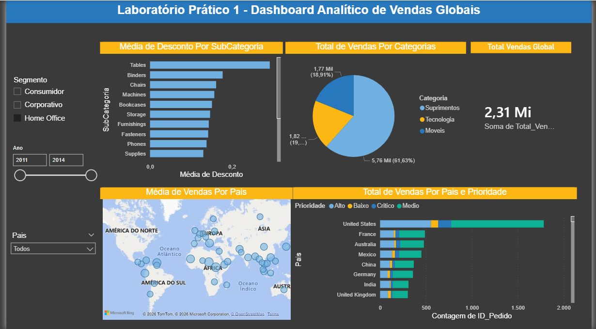

#### [Voltar ao Sumário](#parte-1-business-intelligence)

#### [Voltar ao Sumário](#parte-2-data-science)

## 2. Laboratório Prático 2 - Dashboard de Vendas, Custo, Margem de Lucro e KPI

##  Objetivos
- Conceitos de modelagem de dados;
- Cardinalidade;
- Transformação com Power Query;
- Recursos de limpeza de dados do Power BI
- Criação de gráficos interativos e analíticos.
- Introdução ao DAX.

Foram utilizados dados de vendas fictícios obtidos em 4 diferentes tabelas: Clientes, Pedidos, Produtos e Vendas.

O Dashboard deve responder às seguintes perguntas de negócio e seguir as seguintes especificações:
1. Qual foi o total de valor venda considerando cada modo de envio dos pedidos? Use um gráfico de cascata.
2. Quais mercados tiveram o maior custo médio de envio dos produtos vendidos? Use um gráfico treemap.
3. A empresa tem como objetivo (meta) manter uma média de 350 para o valor de venda todos os meses. Mostre um indicador (KPI – Key Performance Indicator) com o valor médio de venda. A empresa ficou abaixo ou acima da meta no mês de Abril/2014?
4. Considere que o lucro é equivalente a: Valor Venda - Custo Envio. Qual categoria de produto apresentou maior lucro médio?
5. Qual foi o comportamento da margem de lucro ao longo do tempo? Considere a margem de lucro como o Lucro dividido pelo Valor Venda.

### 2.1. Dashboard de Vendas, Custo, Margem de Lucro e KPI
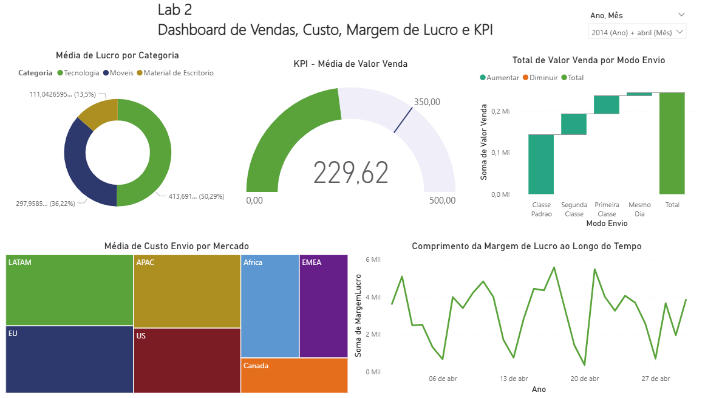

#### [Voltar ao Sumário](#parte-1-business-intelligence)

## 3. Mini-Projeto 1 - Análise de Campanhas de Marketing

##  Objetivos
- Explorar dados de clientes e campanhas de marketing.
- Criar múltiplas visões (cliente, comportamento, performance, padrões de compra).
- Aplicar métricas e cruzamento de dados para avaliar efetividade das campanhas.
- Desenvolver dashboards customizados e interativos.

Este Mini-Projeto trouxe uma breve introdução à análise de campanhas de Marketing com o Power BI. Foram gerados 4 Dashboards, mais de 10 elementos visuais, customizações, formatações, correções nos dados e utilização de diferentes recursos do Power BI. Os dados foram previamente customizados para este Mini-Projeto e representam informações sobre clientes e campanhas de Marketing realizadas por uma empresa fictícia.

Neste Mini-Projeto os relatórios foram divididos em 4 visões:
- Visão do Cliente
- Visão do Comportamento de Compra do Cliente
- Visão da Performance das Campanhas de Marketing
- Visão dos Padrões de Compra no Ponto de Venda (País)

Para cada visão foram compreendidas as variáveis, criados gráficos, medidas, extraídas métricas e cruzados os dados, visando entregar aos tomadores de decisão uma visão bastante completa sobre o perfil dos clientes, os padrões de compra e a efetividade das campanhas de Marketing.

### 3.1. Dashboard - Visão do Cliente
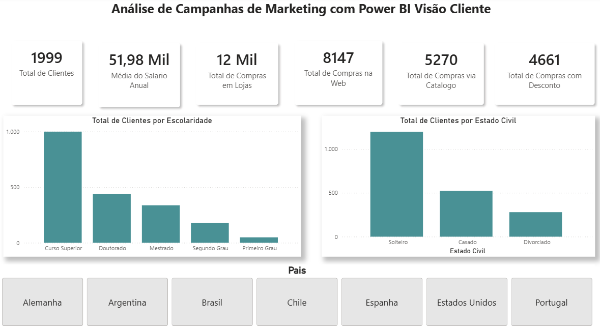

### 3.2. Dashboard - Visão do Comportamento de Compra do Cliente

### 3.3. Dashboard - Visão da Performance das Campanhas de Marketing

### 3.4. Dashboard - Visão dos Padrões de Compra no Ponto de Venda (País)
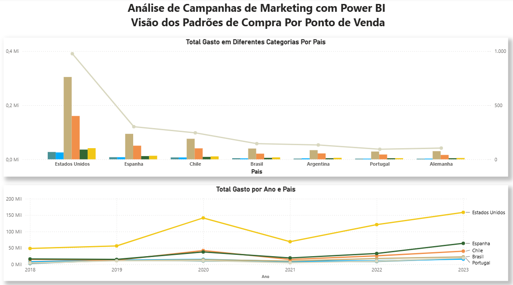

#### [Voltar ao Sumário](#parte-1-business-intelligence)

## 4. Mini-Projeto 2 - Análise de Dados Comerciais: Performance de Vendas

##  Objetivos
- Analisar performance comercial com recursos avançados do Power BI.
- Utilizar Narrativa Inteligente e Principais Influenciadores.
- Criar gráficos de faixas e menus de navegação.
- Apoiar decisões estratégicas do time de vendas.

Neste Mini-Projeto foi desenvolvido uma analise de performance de vendas, ajudando o time comercial de uma empresa fictícia.

Aprendi a trabalhar com a Narrativa Inteligente, Principais Influenciadores, Gráfico de Faixas e criação de menu para índice do Dashboard.

### 4.0. Menu para Navegador de Página
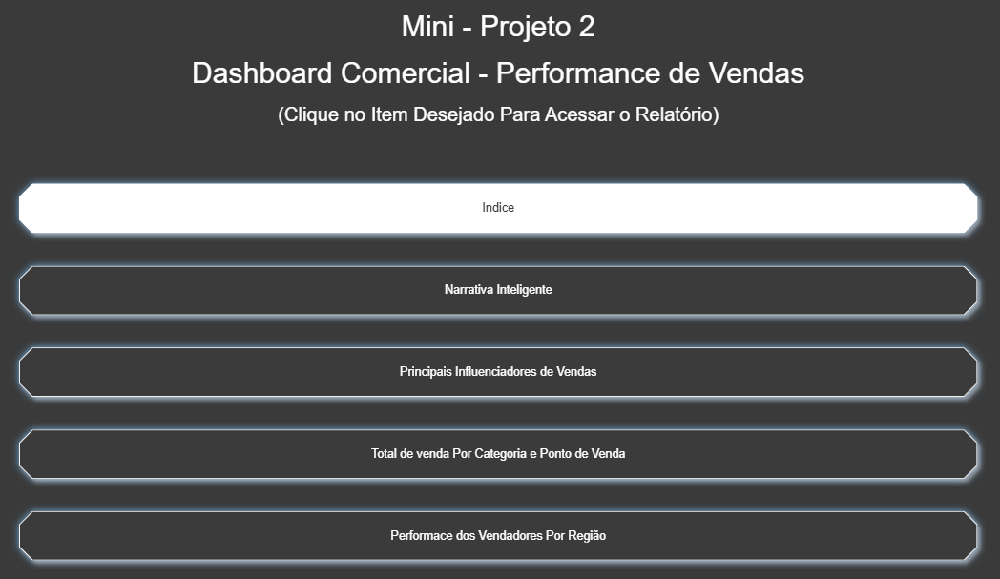

### 4.1. Dashboard - Narrativa Inteligente

### 4.2. Dashboard - Principais Influenciadores de Vendas

### 4.3. Dashboard - Total de venda Por Categoria e Ponto de Venda
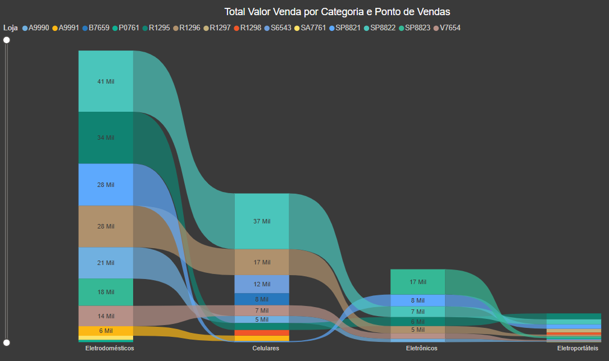

### 4.4. Dashboard - Performance dos Vendedores por Região

#### [Voltar ao Sumário](#parte-1-business-intelligence)

## 5. Mini-Projeto 3 - Análise de Dados de Recursos Humanos

##  Objetivos
- Explorar dados de RH para entender perfil e engajamento dos funcionários.
- Calcular métricas como tempo médio de experiência, salários e promoções.
- Criar dashboards com indicadores de diversidade e envolvimento.
- Apoiar decisões de gestão de pessoas com base em dados.

Este Mini-Projeto trouxe uma breve introdução à análise de dados de RH (Recursos Humanos) com o Power BI, onde foram utilizados dados fictícios. Durante o projeto foram trabalhados alguns outros recursos e funcionalidades do Power BI, como tabela de medidas e coluna condicional. 

O Dashboard criado respondeu às seguintes perguntas de negócio:
- Qual o total de funcionários atualmente na empresa?
- Qual o tempo médio de experiência dos funcionários (em anos)?
- Qual o total e percentual de funcionários do gênero masculino e feminino?
- Qual a média salarial mensal?
- Qual o total de funcionários por função?
- Qual o percentual de funcionários disponíveis para fazer hora extra?
- Qual o nível de envolvimento dos funcionários no trabalho considerando 4 categorias: Ruim, Baixo, Médio e Alto?
- Este item não deve estar no Dashboard, mas precisa ser calculado: Qual o total e o percentual de funcionários que devem receber promoção? Considerando a coluna “Anos Desde a última Promoção” com a seguinte regra: Se o funcionário tiver 5 anos ou mais desde a última promoção, deve ter a promoção considerada. Caso contrário, a promoção não deve ser considerada agora.

### 5.1. Dashboard - Análise de Dados de Recursos Humanos

#### [Voltar ao Sumário](#parte-1-business-intelligence)

## 6. Mini-Projeto 4 - Análise de Dados de Logística

##  Objetivos
- Revisar e corrigir dashboards com problemas de modelagem.
- Criar KPIs de entregas (prazo, atraso, antecipadas).
- Aplicar medidas DAX e filtros avançados.
- Fornecer visão clara da eficiência logística.

Este Mini-Projeto apresentou o seguinte estudo de caso com dados fictícios: Uma empresa de logística solicitou que um profissional fornecesse um dashboard para compreender como está o processo de entrega de produtos da empresa. O profissional não parecia ter muito conhecimento sobre Power BI e entregou um trabalho com nítidos problemas e erros. Os diretores da empresa pediram minha ajuda para revisar o dashboard, identificar e corrigir erros e problemas e apresentar uma nova versão. Todos os erros e problemas detectados devem ser justificados.

O Dashboard precisaria mostrar os seguintes KPIs de Logística:
- Total de Entregas no Prazo Por Canal de Entrega
- Percentual de Entregas Antecipadas Por Equipe de Entrega
- Total de Entregas Por Mês
- Total de Entregas de Produtos dos Top 5 Vendedores
- Total de Entregas com Atraso Por Cidade
- Percentual de Entregas Por Status de Entrega

Durante o projeto foram trabalhados alguns outros recursos e funcionalidades do Power BI, como classificação de rating e filtro com medida DAX. 

### 6.1. Dashboard - Análise de Dados de Logística
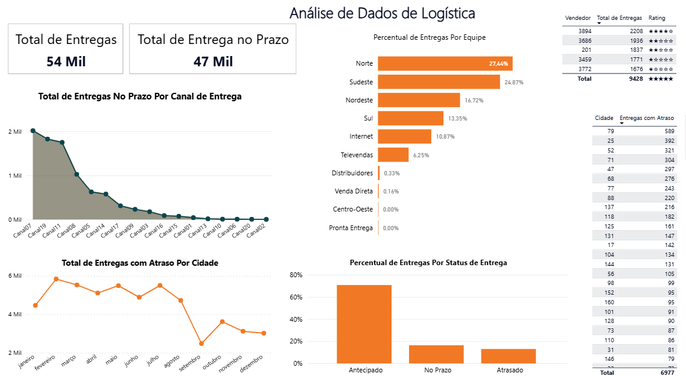

#### [Voltar ao Sumário](#parte-1-business-intelligence)

## 7. Mini-Projeto 5 - Análise de Dados Financeiros

##  Objetivos
- Analisar receitas, despesas e margem de lucro.
- Resolver problemas de layout e pivot de tabelas.
- Criar hierarquias e comparações por componente e ano.
- Apoiar decisões estratégicas financeiras com dashboards claros.

Neste Mini-Projeto foram exploradas mais algumas funcionalidades do Power BI, agora no contexto da área de finanças. Foram utilizados dados fictícios, que continham problemas de layout colocados propositalmente e que foram então resolvidos, utilizando algumas funcionalidades inclusive o pivot de tabela.

Estudo de caso: Sua empresa deseja ter uma visão das receitas e despesas e solicitou que você criasse um Dashboard que permita analisar os seguintes indicadores financeiros:
- Total de Receitas
- Total de Despesas
- Margem de Lucro
- Total de Receitas Por Componente
- Total de Despesas Por Componente em relação à média de Despesas
- Total  de  Receitas e  Despesas Por  Componente  e  Por  Ano, com  a  hierarquia Tipo/Componente.

Além disso a empresa precisa identificar os segmentos onde Receitas e Despesas são maiores e menores a fim de traçar seu plano estratégico. Seu trabalho é converter os dados brutos em conhecimento para suportar a tomada de decisões, através da análise de dados.

### 7.1. Dashboard - Análise de Dados Financeiros
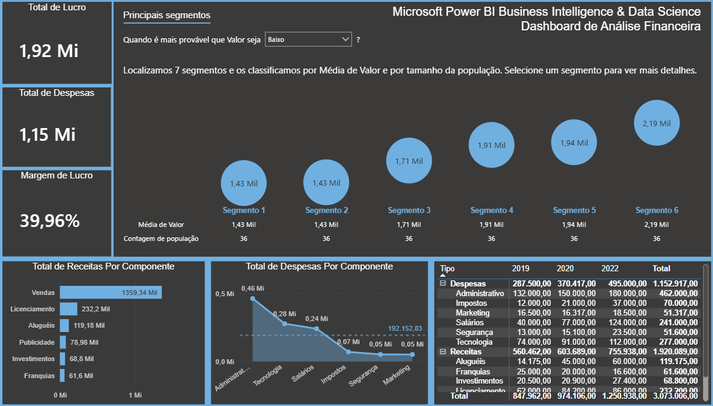

#### [Voltar ao Sumário](#parte-1-business-intelligence)

## 8. Laboratório Prático 3 - Análise de Dados Contábeis: Balanço Patrimonial

##  Objetivos
- Construir relatório contábil no Power BI.
- Explorar visual de matriz e hierarquias.
- Aplicar boas práticas de formatação e análise contábil.
- Apoiar decisões financeiras com relatórios estruturados.

Neste  laboratório foi construído um importante relatório contábil no Power BI, o Balanço Patrimonial. Utilizando dados fictícios, foram exploradas as funcionalidades do visual de Matriz, e estudadas em detalhes outras diversas funcionalidades do Power BI.

### 8.1. Dashboard - Balanço Patrimonial

#### [Voltar ao Sumário](#parte-1-business-intelligence)

## 9. Mini-Projeto 6 - Análise de Dados do Mercado de Ações

##  Objetivos
- Analisar dados reais da NASDAQ (IBM, Microsoft, Oracle, Tesla, Walmart).
- Criar dashboards com volume negociado, preços médios e variações.
- Utilizar Narrativa Inteligente e Time Intelligence.
- Apoiar decisões de investimento com insights visuais.

Neste Mini-Projeto foi construído um Dashboard Analítico do Mercado de Ações. Duas funcionalidades do Power BI foram exploradas: a Narrativa Inteligente e a Time Intelligence (manipulação de data). Foram utilizados dados reais, disponíveis publicamente, extraídos do portal da NASDAQ ([link](https://www.nasdaq.com/market-activity/stocks)). Os dados da NASDAQ incluem várias colunas, cada uma fornecendo informações específicas sobre o preço e o volume de negociação das ações negociadas no mercado. Foram escolhidos dados de 5 empresas: IBM, Microsoft, Oracle, Tesla e Walmart.

O Dashboard deverá responder às seguintes perguntas de negócio e seguir as seguintes especificações:
- Qual o total de volume negociado de ações ao longo do tempo para as 5 empresas que estão sendo analisadas? Permita que essa análise seja feita para uma única empresa ou combinação de empresas.
- Qual o valor médio de abertura (Open), mais alto (High), mais baixo (Low) e de fechamento (Close) das ações de todas as empresas para todos os meses do período de  dados  analisado  (1 ano em nosso exemplo)? Mostre no formato de tabela e permita que essa análise seja feita para uma única empresa ou combinação de empresas.
- Qual a variação da média do valor de fechamento (close) das ações de todas as empresas ao longo do tempo, mês a mês? Permita que essa análise seja feita para uma única empresa ou combinação de empresas.
- Use a Narrativa Inteligente para explicar as principais características e tendências nos dados.
- O Dashboard deve ser formatado.

### 9.1. Dashboard - Análise de Dados do Mercado de Ações

#### [Voltar ao Sumário](#parte-1-business-intelligence)

## 10. Laboratório Prático 4 - Limpeza e Manipulação de Dados de Cadastro de Clientes
##  Objetivos
- Aplicar técnicas de limpeza e transformação de dados de clientes.
- Usar Power Query para manipulação eficiente.
- Preparar dados para análises avançadas.
- Garantir qualidade e consistência das bases de dados

Este laboratório prático foi focado na limpeza e manipulação de dados com Power BI, utilizando dados fictícios. Atividades realizadas durante o laboratório:
- Identificação e tratamento de registros duplicados.
- Identificação e tratamento de valores ausentes.
- Identificação e tratamento de valores outliers. 

### 10.1. Visualizando os outliers
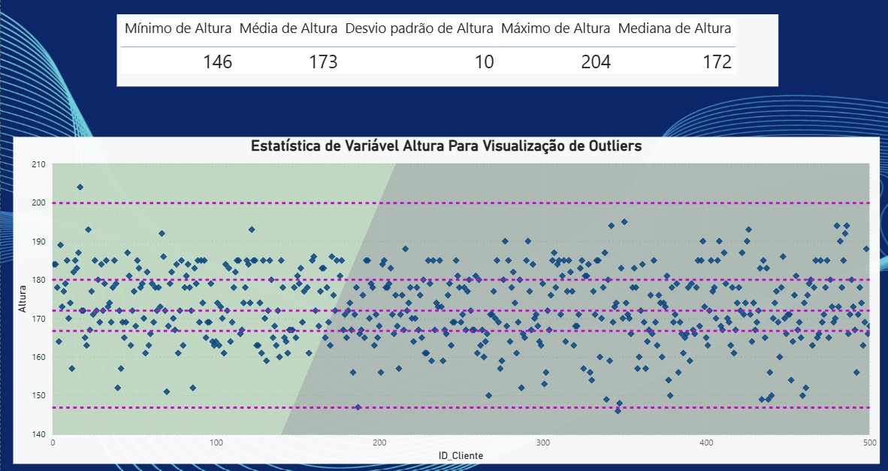

#### [Voltar ao Sumário](#parte-2-data-science)

## 11. Laboratório Prático 5 - Engenharia de Atributos com Linguagem M
Neste Laboratório foi demonstrado como a Linguagem M pode ser usada no Power BI para realizar uma das mais importantes tarefas em Ciência de Dados: a Engenharia de Atributos. Utilizando dados fictícios, foram aplicadas diversas tarefas e etapas como criação de novas variáveis, remoção de variáveis desnecessárias, transformações e correções.

##  Objetivos
- Limpar  e  transformar  dados  (como  remover  linhas,  colunas  ou  preencher  valores ausentes);
- Combinar dados de diferentes fontes (como mesclar ou anexar consultas);
- Converter  tipos  de  dados  e  formatar  dados (como  converter  texto  para  número  ou data).•Aplicar transformações condicionais e agregar dados.

#### [Voltar ao Sumário](#parte-2-data-science)

## 12. Laboratório Prático 6 - Integrando Banco de Dados com Power BI para Extração e Análise de Dados 
Neste laboratório foi demonstrado como conectar o Power BI a bancos de dados para extrair dados e criar análises, através de uma conexão ODBC (Open Database Connectivity). Utilizados dados fictícios e o banco de dados SQLite.

##  Objetivos

- Aplicar técnicas de limpeza e transformação de dados de clientes.
- Usar Power Query para manipulação eficiente.
- Preparar dados para análises avançadas.
- Garantir qualidade e consistência das bases de dados

### 12.1. Exibição do Modelo
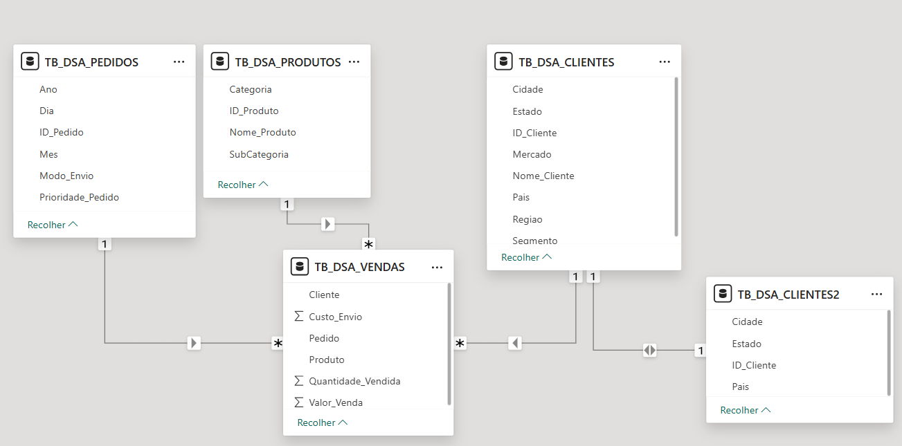

#### [Voltar ao Sumário](#parte-2-data-science)

## 13. Laboratório Prático 7 - Machine Learning com Linguagem Python e Power BI dentro do Jupyter Notebook
Este laboratório prático apresentou o seguinte estudo de caso com dados fictícios: Imagine que uma empresa tenha dados históricos de clientes que fizeram compras de produtos ou serviços. Os dados incluem, para cada cliente: idade, renda anual e uma pontuação de gasto (poder de compra do cliente). A empresa gostaria de segmentar esses clientes em 3 grupos de acordo com similaridades a fim de personalizar as campanhas de Marketing. O gestor da área de Marketing espera receber um relatório com os 3 segmentos e para cada segmento a média de idade, renda anual e pontuação de gastos dos clientes. Seu trabalho é fazer isso acontecer utilizando Machine Learning.

##  Objetivos
- Utilizar Python para treinar e avaliar modelos de Machine Learning.
- Trabalhar dentro do Jupyter Notebook, ambiente ideal para experimentação e documentação de código.
- Conectar os resultados ao Power BI, permitindo que previsões e classificações sejam incorporadas em dashboards interativos.
- Desenvolver a capacidade de transformar dados em insights preditivos, ampliando o valor das análises de Business Intelligence.

Para escrever e executar o Python, foi utilizado dento do VSCODE e foram empregadas as seguintes etapas:
1. Carregamento dos dados
2. Análise exploratória
3. Pré-processamento dos dados
4. Construção e treinamento do modelo de Machine Learning
5. Publicação do Relatório no Power BI Online
6. Edição do Relatório no Power BI Desktop
7. Publicação do Relatório editado no Power BI Online

### 13.1. Dashboard - Segmentação de Clientes
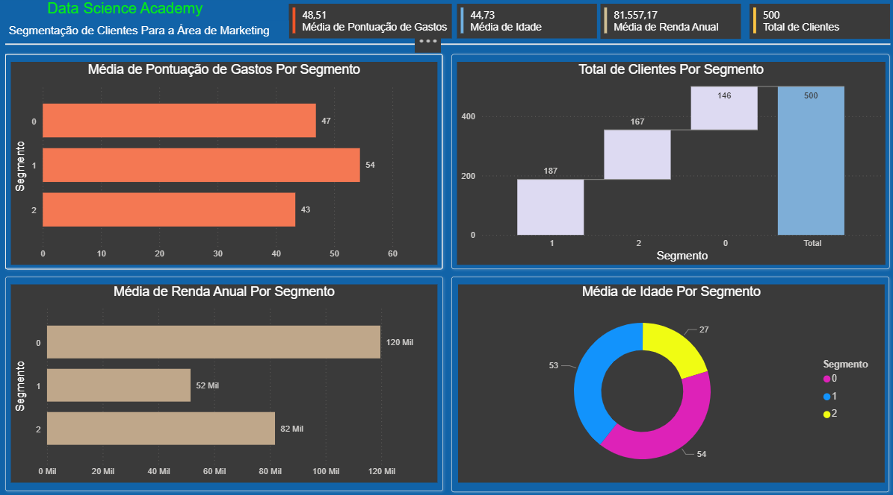

#### [Voltar ao Sumário](#parte-2-data-science)

## 14. Laboratório Prático 8 - Detecção de Anomalias em Transações Financeiras com Linguagem R e Power BI
Este laboratório prático apresentou o seguinte estudo de caso com dados fictícios: Imagine que uma empresa da área financeira tenha dados históricos de clientes com duas transações financeiras (aqui chamadas de “transacao1” e “transacao2”). Os gestores acreditam que algumas dessas transações possam ser fraudulentas e gostariam de identificar as eventuais anomalias. Os gestores não fazem ideia do que seria uma anomalia e pediram sua ajuda para encontrar uma solução. De fato, eles não sabem se anomalias realmente ocorreram. Seu trabalho é usar Machine Learning para agrupar os dados de transações financeiras dos clientes e então detectar e definir as anomalias (se existirem). O resultado deve ser entregue no formato visual através de gráficos no Power BI.

Para este laboratório foi utilizado o RStudio e foram executadas as seguintes etapas:

##  Objetivos

1. Instalação e carregamento dos pacotes para detecção de anomalias, manipulação e visualização de dados
2. Carregamento dos dados
3. Criação e treinamento do modelo de Machine Learning
4. Previsões com o modelo usando os dados históricos
5. Definição das anomalias de acordo com o *anomaly score*
6. Aplicação do modelo de detecção de anomalias a novos dados
7. Análise das anomalias com boxplot em linguagem R
8. Análise das anomalias com boxplot no Power BI

Obs.: Algumas etapas intermediárias de preparação dos dados, como a análises exploratórias, limpezas e checagens, não foram realizadas pois os dados fictícios já foram previamente corrigidos e formatados.

### 14.1. Boxplot de Dados Anômalos e Dados Normais
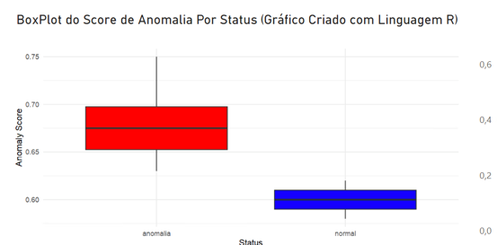

### 14.2. Dashboard - Detecção de Anomalias em Transações Financeiras
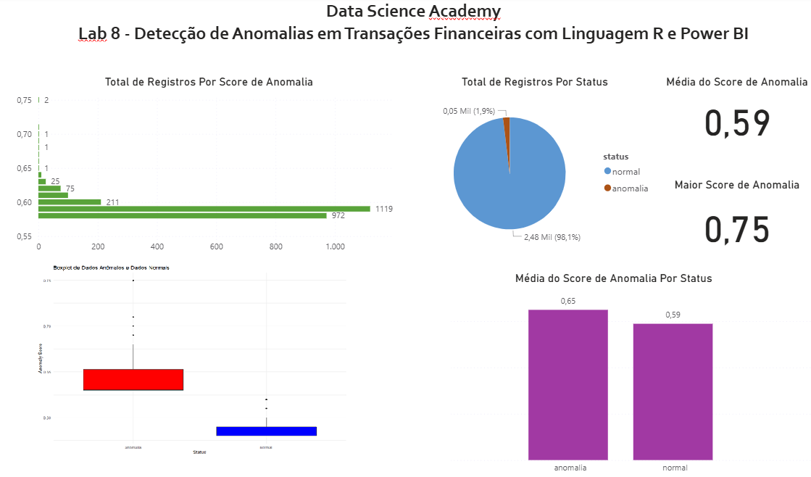

#### [Voltar ao Sumário](#parte-2-data-science)

## 15. Laboratório Prático 9 - Engenharia de Produção com Power BI e IA: Prevendo a Produção Industrial ao Longo do Tempo
Neste laboratório o Power BI foi usado para manipular e compreender os dados, explorando alguns conceitos de análise de séries temporais utilizando dados fictícios. Por fim, foram apresentados recursos de IA do Power BI para prever a média de unidades produzidas ao longo do tempo e detecção de anomalias. O Dashboard criado ao final do laboratório serve como ponto de partida para o dia a dia de Engenheiros de Produção.

##  Objetivos

- Manipular e compreender dados fictícios de produção.
- Explorar recursos de Inteligência Artificial do Power BI para prever a média de unidades produzidas ao longo do tempo.
- Implementar técnicas de detecção de anomalias em séries temporais.
- Criar um dashboard interativo que sirva como ponto de partida para engenheiros de produção no acompanhamento e tomada de decisão.

### 15.1 Dashboard - Produção Industrial ao Longo do Tempo
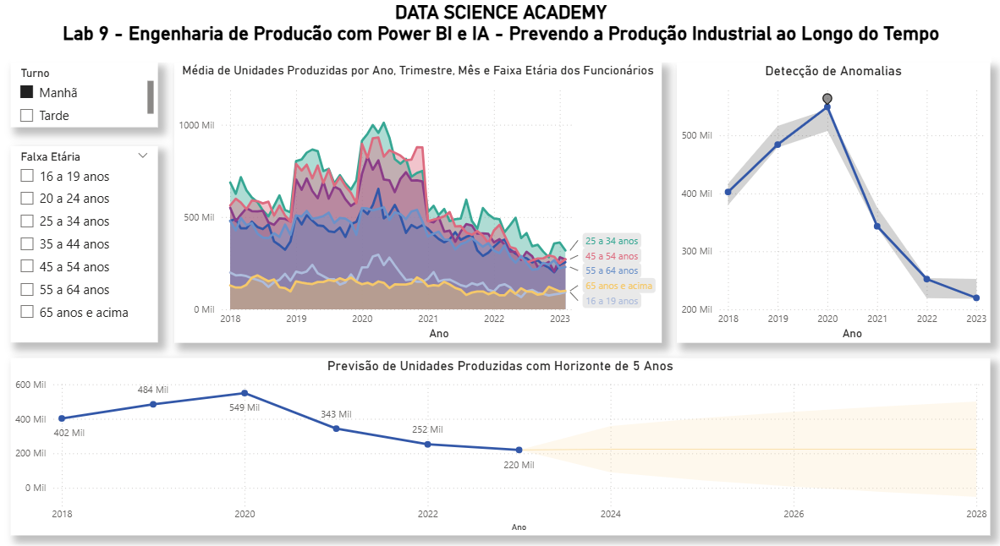

#### [Voltar ao Sumário](#parte-2-data-science)

## 🔗 Links
- [Meu LinkedIn](https://www.linkedin.com/in/licinio-gti/)
- [Portfólio completo no GitHub](https://github.com/mslicinio)
